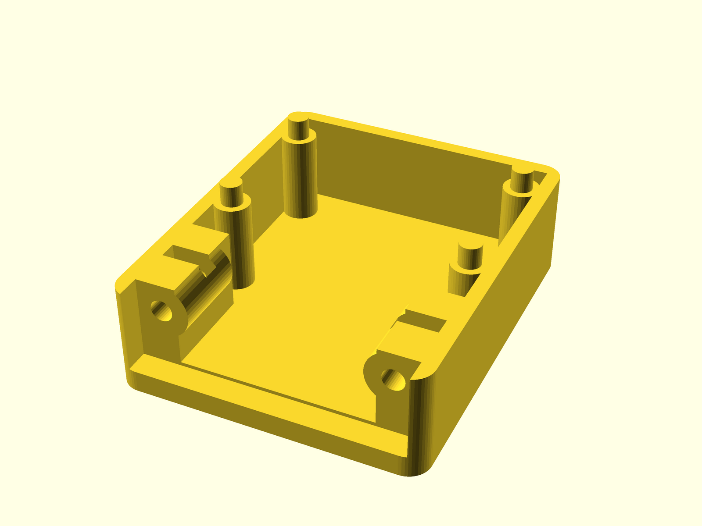
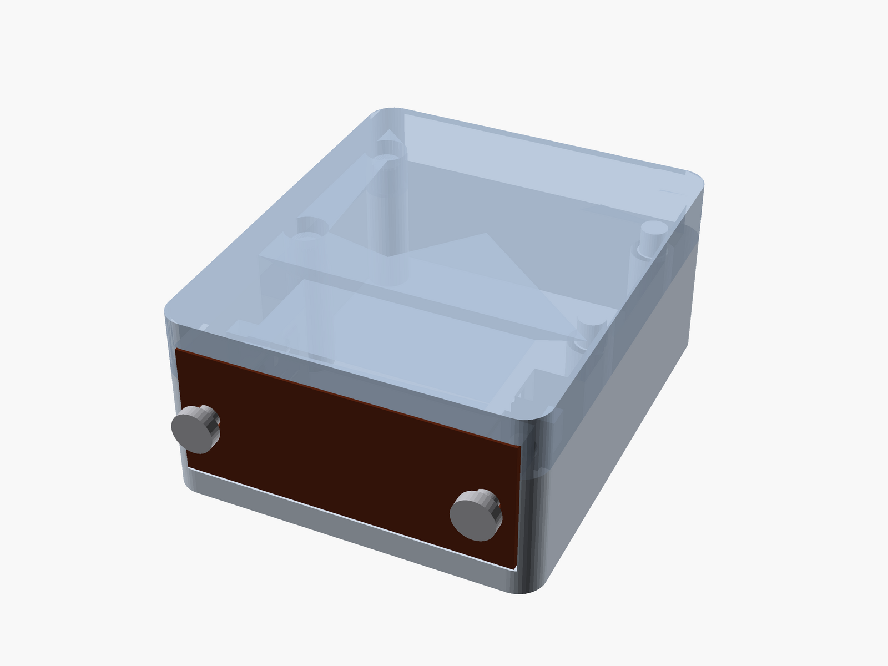
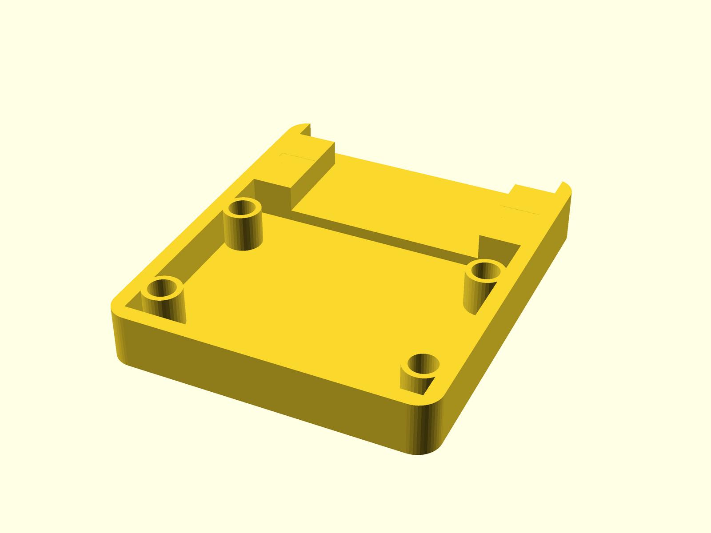

# RG1N-1-4 loopback case

A compact two-piece case for a wired 12-contact female РГ1Н-1-4 (RG1N-1-4)
loopback connector. The connector face remains accessible while the rear body,
solder contacts, and loopback wiring are enclosed.

The finished case is **40 × 33 × 17.2 mm**. Its 1.6 mm structural walls are
four extrusion lines with a 0.4 mm nozzle.







## Connector dimensions and assumptions

The available [catalog listing and dimensional drawing](https://ipelectron.ru/katalog/soediniteli/pryamougolnye/rg1n_rsh2n/rg1n_1_4_rozetka_shchelevye_kontakty_karbolit_1/)
and [series datasheet](https://www.quartz1.com/price/PIC/115Q0118700.pdf)
give the following dimensions:

| Parameter | Value |
| --- | ---: |
| Contacts | 12, in two rows |
| Contact pitch | 2.8 mm |
| Insulator/flange width | 29.4 mm |
| Insulator depth | 12 mm |
| Insulator height | 10.9 mm |
| Flange thickness | 2.5 mm max |
| Rear projection from mounting face | 12.5 mm max |
| Mounting-hole spacing | 24.5 mm |
| Mounting thread | M2 |

The drawing does not separately dimension the narrower rear body. Its default
20.5 × 11 mm envelope was estimated from the drawing and product photos. Measure
the physical connector before committing to a full print; all fit dimensions
are grouped in `dimensions.scad`.

The flange pocket adds 0.2 mm clearance per side. The rear-body throat adds
0.3 mm per side, then opens into a 29.8 × 14 mm wire chamber. The front face is
recessed flush with the case and the original retaining wire remains outside.

Two longitudinal M2 clearance bores align with the connector's mounting holes.
Each bolt engages a standard M2 hex nut captured inside a reinforced printed
boss, securing the case directly to the socket. The nut traps are opened from
the top of the deeper lower half for easy loading before the lid is installed.
Both horizontal bosses have solid buttresses extending to the lower print bed;
no portion of a mounting boss is left hanging in the lid.

## Assembly

1. Print `rg1n-loopback-case.stl` and `rg1n-loopback-case-lid.stl` in their
   provided orientations, without supports.
2. Drop two standard M2 nuts into the hexagonal slots near the front of the
   lower half.
3. Place the wired connector in the lower half with its flange in the front
   recess and fold the loopback wiring into the rear chamber.
4. Test the lid on the four 2.4 mm alignment pins. Ream the 2.8 mm blind holes
   only if elephant-foot or over-extrusion makes the fit too tight.
5. Replace the connector's side fasteners with two M2×10 mm bolts inserted from
   the socket face through the retaining-wire hardware and into the captive
   nuts. Use M2×12 mm bolts if the original washers need more length.
6. After verifying the loopback, optionally secure the rear seam with a few
   small drops of CA glue. The bolts anchor the case to the socket; the pins
   align the two printed halves.

## Export

From the repository root:

```bash
./scripts/open.sh rg1n-loopback-case
./scripts/check-render.sh
./scripts/export-stls.sh
./scripts/render-previews.sh
```

This produces:

- `rg1n-loopback-case.stl`
- `rg1n-loopback-case-lid.stl`
