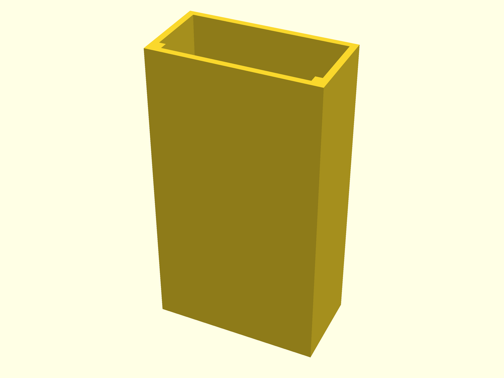
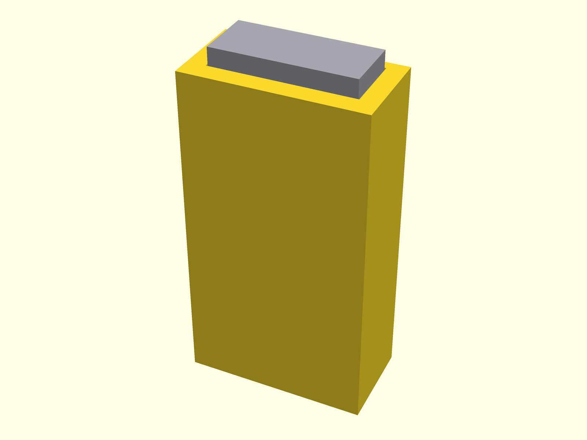

# USB serial adapter case

A simple one-piece, open-top case for the DIYMORE FT232BM/BL USB to
RS232/UART TTL/RS485 adapter ([product page](https://www.diymore.cc/products/usb-to-serial-rs232-uart-ttl-rs485-db9-adapter-converter-module-for-ftdi-ft232bm-bl-provide-the-usb-driver-for-linux-for-windows)).

The case is a deep, well-like sleeve aligned with the board's length. The USB-B
end forms the closed bottom, with a hole for the connector, while the DB9 end
accepts a separate flat lid with a close-fitting DB9 opening. The PCB slides
in lengthwise on two internal guide ribs. To reach the jumpers, headers, or
terminal block, remove the lid and pull the board out through the DB9 end.

The model is already oriented for printing upright on the USB end.





## Important: verify the dimensions

The seller does not publish a mechanical drawing. The defaults in `model.scad`
were estimated from the product's straight-on photo, using the terminal block's
standard 5.08 mm pitch as scale:

| Parameter | Initial value |
| --- | ---: |
| PCB length | 65 mm (confirmed) |
| PCB width | 35 mm (confirmed) |
| PCB thickness | 1.6 mm |
| Wall and floor thickness | 1.6 mm |
| Clearance across PCB width | 0.8 mm per side |
| Clearance under PCB | 2 mm |
| Component height above PCB | 13 mm (estimated) |
| PCB edge supported by each guide | 0.8 mm |
| DB9 envelope | 31 × 13 mm (estimated) |
| DB9 lid clearance | 0.25 mm per side |

Measure the physical board before printing the complete case. The dimensions,
clearances and port positions are grouped at the top of the source for easy
adjustment. A good first test is the bottom 10–15 mm containing the USB opening
and the start of the guide ribs.

## Reference photos

The useful photos from the product listing are preserved in [`reference/`](reference/)
so the model's purpose and connector layout remain understandable if the
listing changes or disappears. Their source and original URLs are recorded in
that directory; the images remain the property of their respective owner.

## Export

From the repository root:

```bash
./scripts/open.sh usb-serial-adapter-case
./scripts/check-render.sh
./scripts/export-stls.sh
./scripts/render-previews.sh
```

This generates two printable files:

- `usb-serial-adapter-case.stl`
- `usb-serial-adapter-case-lid.stl`
